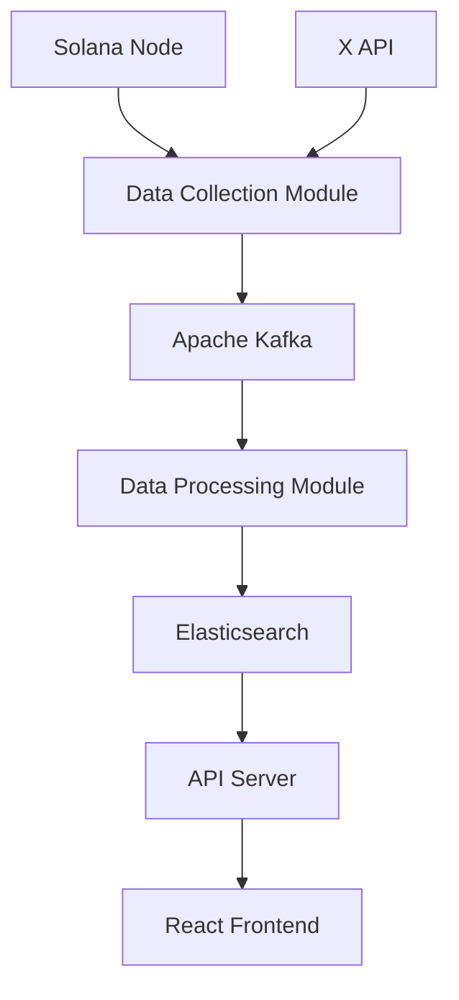

# Btracker Architecture Overview

This document provides a detailed overview of Btracker's system architecture and technical implementation.

## System Architecture

### High-Level Overview



## Core Components

### 1. Data Collection Module

- **Solana WebSocket Client**
  - Connects to Solana nodes via WebSocket API
  - Monitors Believe program for token issuance events
  - Achieves 50ms latency for data capture

- **X API Integration**
  - Streams X posts related to token launches
  - Captures project descriptions and metadata

### 2. Data Processing Module

- **Apache Kafka Pipeline**
  - Handles high-throughput event streaming
  - Ensures reliable data processing
  - Supports horizontal scaling

- **NLP Processing**
  - Uses BERT-based models for text analysis
  - Extracts structured information from X posts
  - Categorizes project types and features

### 3. Storage and Indexing

- **Elasticsearch**
  - Primary data store for token information
  - Enables fast full-text search
  - Supports real-time analytics

- **Redis Cache**
  - Caches frequently accessed data
  - Reduces database load
  - Improves response times

### 4. API Server

- **REST API**
  - Provides token data access
  - Handles authentication and rate limiting
  - Supports pagination and filtering

- **WebSocket Server**
  - Pushes real-time updates to clients
  - Manages client connections
  - Implements heartbeat mechanism

### 5. Frontend Application

- **React Components**
  - Real-time price charts
  - Token listing views
  - Search and filter interface

- **State Management**
  - Redux for global state
  - WebSocket integration
  - Caching layer

## Data Flow

### Token Launch Flow

1. **Event Detection**
   ```mermaid
   sequenceDiagram
       participant X as X Platform
       participant S as Solana Network
       participant B as Btracker
       participant U as Users
       
       X->>S: Token Launch Post
       S->>B: Token Creation Event
       B->>B: Process & Validate
       B->>U: Real-time Update
   ```

2. **Data Processing Pipeline**
   - Capture token creation event
   - Fetch associated X post
   - Extract project information
   - Validate data accuracy
   - Store in Elasticsearch
   - Notify subscribers

## Performance Optimization

### 1. Low Latency Architecture

- WebSocket connections for real-time data
- Distributed caching with Redis
- Connection pooling for databases
- Load balancing across services

### 2. High Availability

- Multiple Solana node connections
- Kafka cluster for message queuing
- Elasticsearch cluster for data storage
- Kubernetes for container orchestration

### 3. Scalability

- Horizontal scaling of services
- Microservices architecture
- Database sharding strategies
- CDN for static content

## Security Measures

### 1. API Security

- JWT-based authentication
- Rate limiting per API key
- Input validation and sanitization
- HTTPS encryption

### 2. Data Security

- Encrypted data storage
- Regular security audits
- Access control lists
- Audit logging

## Monitoring and Maintenance

### 1. System Monitoring

- Prometheus metrics collection
- Grafana dashboards
- ELK stack for log analysis
- Alert system for anomalies

### 2. Performance Metrics

- Response time tracking
- Error rate monitoring
- Resource utilization
- User engagement metrics

## Development Workflow

### 1. Code Organization

```
src/
├── backend/
│   ├── data_collection/
│   ├── processing/
│   ├── api/
│   └── websocket/
├── frontend/
│   ├── components/
│   ├── services/
│   └── store/
└── shared/
    └── types/
```

### 2. Deployment Pipeline

- GitHub Actions for CI/CD
- Docker containers for services
- Kubernetes for orchestration
- Automated testing suite

## Future Scalability

### 1. Planned Improvements

- GraphQL API implementation
- Machine learning for price prediction
- Enhanced analytics dashboard
- Mobile application support

### 2. Infrastructure Expansion

- Multi-region deployment
- Enhanced caching strategies
- Improved fault tolerance
- Advanced monitoring tools

## Technical Specifications

### 1. Performance Requirements

- Data capture latency: < 50ms
- API response time: < 100ms
- WebSocket message delay: < 10ms
- System uptime: 99.9%

### 2. Capacity Planning

- Daily active users: 100,000+
- Token launches per day: 50+
- API requests per second: 1,000+
- Data storage growth: 1TB/month

## Conclusion

Btracker's architecture is designed for high performance, reliability, and scalability. The system's modular design and use of modern technologies ensure it can handle the demanding requirements of real-time token indexing while maintaining flexibility for future enhancements.