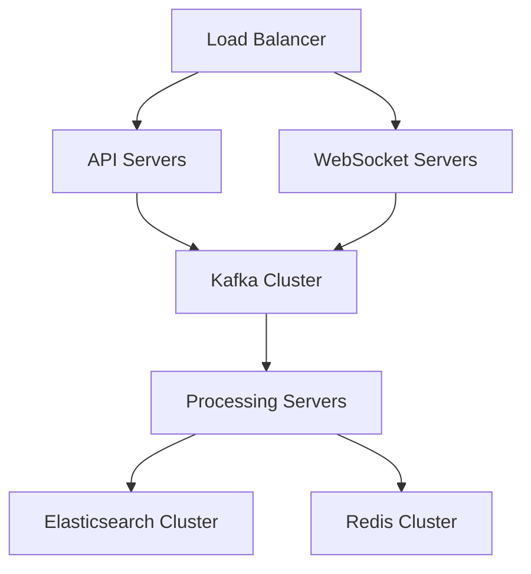

# Btracker Deployment Guide

This guide provides comprehensive instructions for deploying Btracker in a production environment.

## Production Environment Requirements

### Hardware Requirements

#### Minimum Specifications
- CPU: 8 cores
- RAM: 32GB
- Storage: 500GB SSD
- Network: 1Gbps

#### Recommended Specifications
- CPU: 16 cores
- RAM: 64GB
- Storage: 1TB NVMe SSD
- Network: 10Gbps

### Software Requirements

- Docker Engine 20.10+
- Docker Compose 2.0+
- Kubernetes 1.22+
- Nginx 1.20+
- Let's Encrypt SSL certificates

## Deployment Architecture



## Deployment Steps

### 1. Infrastructure Setup

#### Configure Load Balancer

```nginx
# /etc/nginx/conf.d/btracker.conf
upstream api_servers {
    server api1.btracker.io:8000;
    server api2.btracker.io:8000;
}

upstream websocket_servers {
    server ws1.btracker.io:8001;
    server ws2.btracker.io:8001;
}

server {
    listen 443 ssl http2;
    server_name api.btracker.io;

    ssl_certificate /etc/letsencrypt/live/api.btracker.io/fullchain.pem;
    ssl_certificate_key /etc/letsencrypt/live/api.btracker.io/privkey.pem;

    location /api/ {
        proxy_pass http://api_servers;
        proxy_set_header Host $host;
        proxy_set_header X-Real-IP $remote_addr;
    }

    location /ws/ {
        proxy_pass http://websocket_servers;
        proxy_http_version 1.1;
        proxy_set_header Upgrade $http_upgrade;
        proxy_set_header Connection "upgrade";
    }
}
```

#### Setup Kubernetes Cluster

```bash
# Install kubectl
curl -LO "https://dl.k8s.io/release/$(curl -L -s https://dl.k8s.io/release/stable.txt)/bin/linux/amd64/kubectl"

# Apply configurations
kubectl apply -f k8s/
```

### 2. Database Setup

#### Elasticsearch Configuration

```yaml
# elasticsearch.yml
cluster.name: btracker-production
node.name: ${HOSTNAME}

network.host: 0.0.0.0

discovery.seed_hosts: ["es-node1", "es-node2", "es-node3"]
cluster.initial_master_nodes: ["es-node1", "es-node2", "es-node3"]

xpack.security.enabled: true
xpack.security.transport.ssl.enabled: true
```

#### Redis Cluster Setup

```bash
# Initialize Redis cluster
redis-cli --cluster create \
    redis-node1:6379 \
    redis-node2:6379 \
    redis-node3:6379 \
    --cluster-replicas 1
```

### 3. Application Deployment

#### Backend Deployment

```yaml
# k8s/backend-deployment.yaml
apiVersion: apps/v1
kind: Deployment
metadata:
  name: btracker-backend
spec:
  replicas: 3
  selector:
    matchLabels:
      app: btracker-backend
  template:
    metadata:
      labels:
        app: btracker-backend
    spec:
      containers:
      - name: btracker-backend
        image: btracker/backend:latest
        ports:
        - containerPort: 8000
        env:
        - name: RUST_LOG
          value: "info"
        - name: DATABASE_URL
          valueFrom:
            secretKeyRef:
              name: btracker-secrets
              key: database-url
```

#### Frontend Deployment

```yaml
# k8s/frontend-deployment.yaml
apiVersion: apps/v1
kind: Deployment
metadata:
  name: btracker-frontend
spec:
  replicas: 2
  selector:
    matchLabels:
      app: btracker-frontend
  template:
    metadata:
      labels:
        app: btracker-frontend
    spec:
      containers:
      - name: btracker-frontend
        image: btracker/frontend:latest
        ports:
        - containerPort: 80
```

### 4. Monitoring Setup

#### Prometheus Configuration

```yaml
# prometheus.yml
global:
  scrape_interval: 15s

scrape_configs:
  - job_name: 'btracker-backend'
    static_configs:
      - targets: ['backend:8000']

  - job_name: 'btracker-frontend'
    static_configs:
      - targets: ['frontend:80']
```

#### Grafana Dashboard Setup

```bash
# Import dashboard configurations
curl -X POST -H "Content-Type: application/json" \
     -d @dashboards/system-metrics.json \
     http://grafana:3000/api/dashboards/db
```

## Security Configuration

### 1. Firewall Rules

```bash
# Allow necessary ports
ufw allow 80/tcp
ufw allow 443/tcp
ufw allow 8000/tcp
ufw allow from 10.0.0.0/8 to any port 6379 # Redis
ufw allow from 10.0.0.0/8 to any port 9200 # Elasticsearch
```

### 2. SSL Certificate Setup

```bash
# Install certbot
apt-get install certbot python3-certbot-nginx

# Obtain certificate
certbot --nginx -d api.btracker.io -d ws.btracker.io
```

## Backup and Recovery

### 1. Database Backup

```bash
# Elasticsearch backup
curl -X PUT "localhost:9200/_snapshot/backup_repository" -H 'Content-Type: application/json' -d'
{
  "type": "fs",
  "settings": {
    "location": "/mnt/backups/elasticsearch"
  }
}'

# Create backup
curl -X PUT "localhost:9200/_snapshot/backup_repository/snapshot_1?wait_for_completion=true"
```

### 2. Application Backup

```bash
# Backup Kubernetes configurations
kubectl get all --all-namespaces -o yaml > k8s-backup.yaml
```

## Scaling Guidelines

### 1. Horizontal Scaling

```bash
# Scale backend pods
kubectl scale deployment btracker-backend --replicas=5

# Scale frontend pods
kubectl scale deployment btracker-frontend --replicas=3
```

### 2. Vertical Scaling

Update resource requests and limits in deployment configurations:

```yaml
resources:
  requests:
    cpu: "2"
    memory: "4Gi"
  limits:
    cpu: "4"
    memory: "8Gi"
```

## Maintenance Procedures

### 1. Rolling Updates

```bash
# Update backend image
kubectl set image deployment/btracker-backend \
    btracker-backend=btracker/backend:new-version

# Monitor rollout
kubectl rollout status deployment/btracker-backend
```

### 2. Database Maintenance

```bash
# Elasticsearch optimization
curl -X POST "localhost:9200/_optimize?max_num_segments=1"

# Redis memory optimization
redis-cli CONFIG SET maxmemory-policy allkeys-lru
```

## Monitoring and Alerting

### 1. System Metrics

Monitor the following metrics:
- CPU usage
- Memory usage
- Disk I/O
- Network traffic
- Request latency
- Error rates

### 2. Alert Configuration

```yaml
# alertmanager.yml
route:
  group_by: ['alertname']
  group_wait: 30s
  group_interval: 5m
  repeat_interval: 1h
  receiver: 'team-email'

receivers:
- name: 'team-email'
  email_configs:
  - to: 'team@btracker.io'
```

## Troubleshooting

### 1. Common Issues

#### High Latency
1. Check network connectivity
2. Monitor database performance
3. Review application logs
4. Analyze system metrics

#### Memory Issues
1. Check container memory limits
2. Monitor memory usage
3. Review memory leak possibilities

### 2. Log Analysis

```bash
# View application logs
kubectl logs -f deployment/btracker-backend

# View system logs
journalctl -u docker.service
```

## Contact and Support

### Emergency Contacts

- System Administrator: admin@btracker.io
- DevOps Team: devops@btracker.io
- Security Team: security@btracker.io

### Support Resources

- Documentation: https://docs.btracker.io
- Status Page: https://status.btracker.io
- Support Portal: https://support.btracker.io